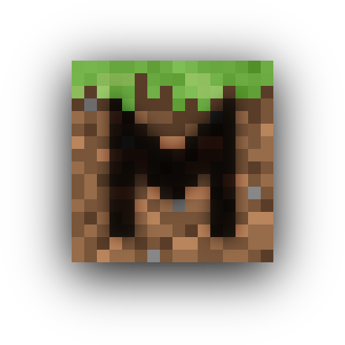

# GameFramework

> A WIP framework for writing Bukkit minigame plugins in a single class file.

## What is this repository?

This is the home of all my planning docs and the eventual home of the source code for my Minecraft minigame framework.

## The Idea

This project has been a dream of mine for a while. Servers like Hypixel or Mineplex have made minigames quite popular, but few people have the money, time and resources to make their own minigames. A year or two ago I had an idea for a component-based system where minigames are described as a series of gameplay elements and objectives. Over time I've honed the idea, and I just recently revived the project.

In theory, entire minigames could be made in a single class file. All they would have to do is describe some phases of the game, the various objectives and gameplay components of each phase, and then let the framework do the rest. All command handling, arena management and data storage would be taken care of by the framework.

## Is this really plausible?

Is it _possible?_ Yes. However, this won't be an easy project. I'm still in the super-mega-alpha planning stage.

## What needs to be done?

My plan for now is to try and describe as many minigames as I can in a compenent-based syntax. This will let me know what features the components will need, and that will make writing the actual framework infinitely easier.

After that is complete, I'll need to determine an abstraction layer for arena handling. Not every minigame handles arenas the same way, but I'm sure there's a way to abstract the differences away.

## Examples

These are a few examples I've written up in a human-readable syntax, describing each phase and the components required.

1. [Quake](example-games/1-Quake.md)
2. [SkyWars](example-games/2-SkyWars.md)
